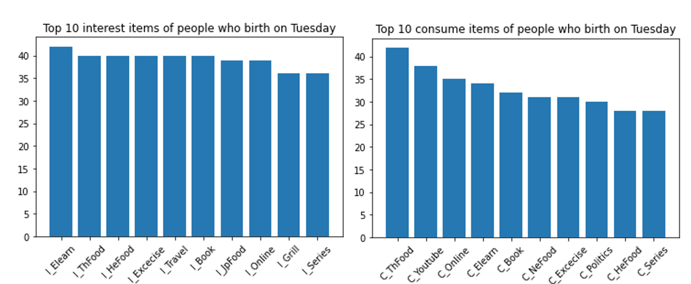
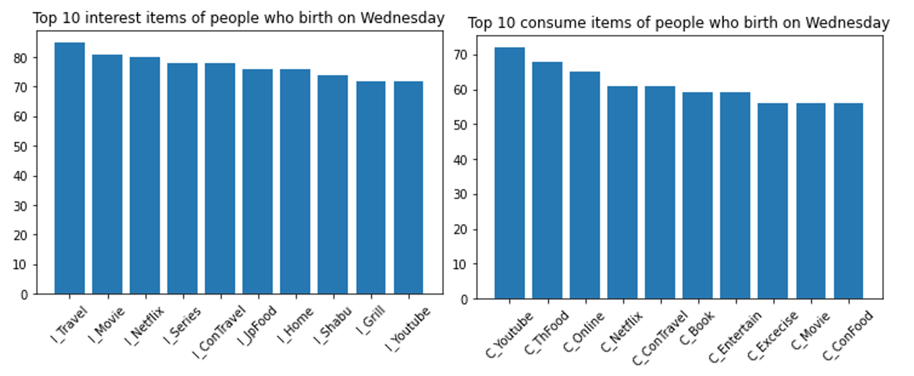
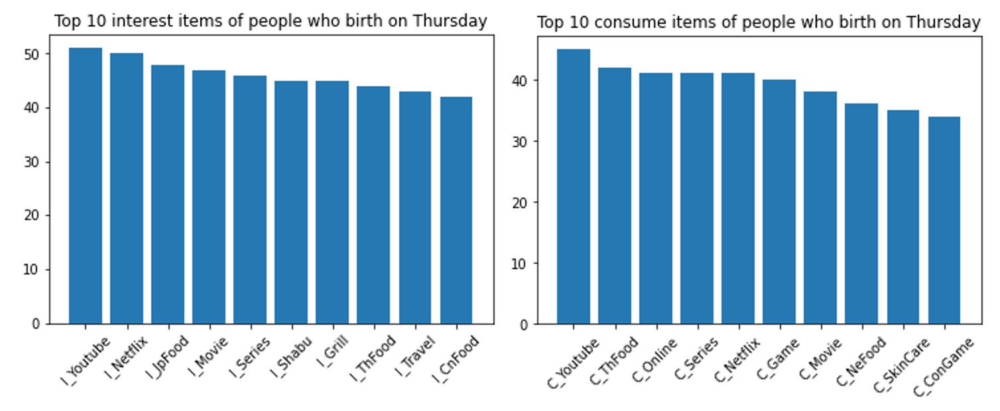
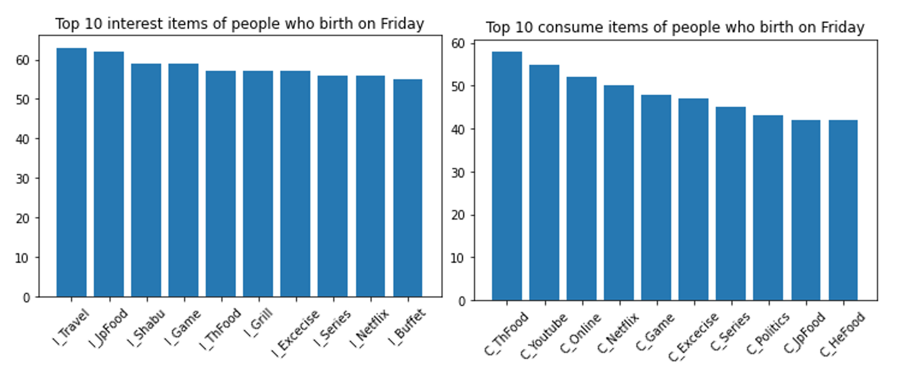
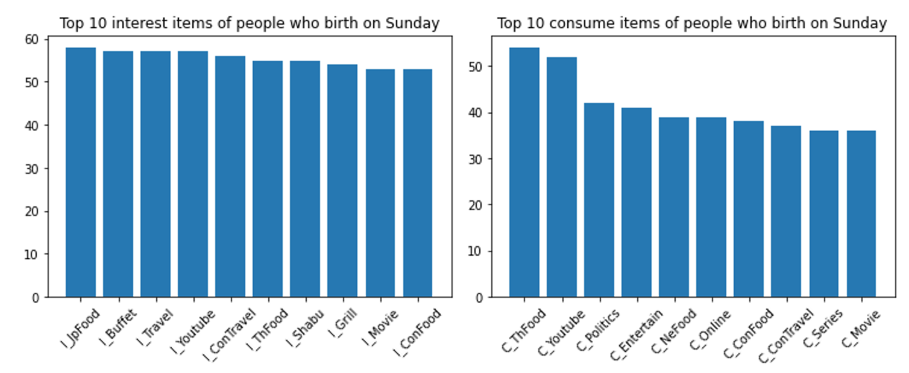

# Analysis Customer Behavior
The survey asking about intersts and consumptions of 30 things from CRM students

## Example data after creansing

**Data**
We change text to be numeric for calculation

## Comparing
### Compare top 10 interesting with top 10 consuming of CRM students.

You will see the most interesting item is japaneese food but it does not contain in top 10 consuming itmes of CRM students. It means the interesting is not related with consuming directly.

### Comapare top 10 interesting with top 10 consuming by gender.

You will see the intereting of male and female quite common. Both also have most interested in japaneese food and traveling but male are interested in games but female don't.

### Top 10 interesting by day of birth

Monday

Tuesday

Wednesday

Thursday

Friday

Saturday

Sunday

The CRM students that born on Monday, Saturday and Sunday are interted in japaneese food, person who born on Tuesday are most interested in E-learning. The person who born on Wednesday and Friday are interested in travel and person who born on Thursday are most interested in youtube.