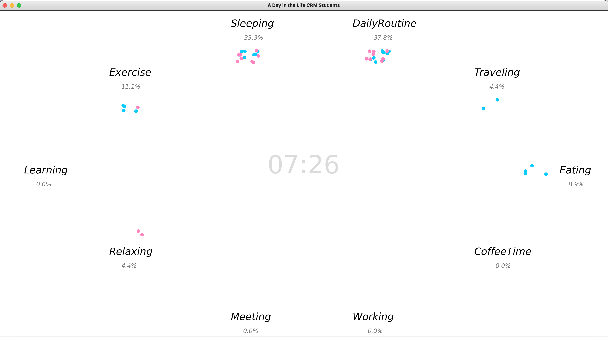
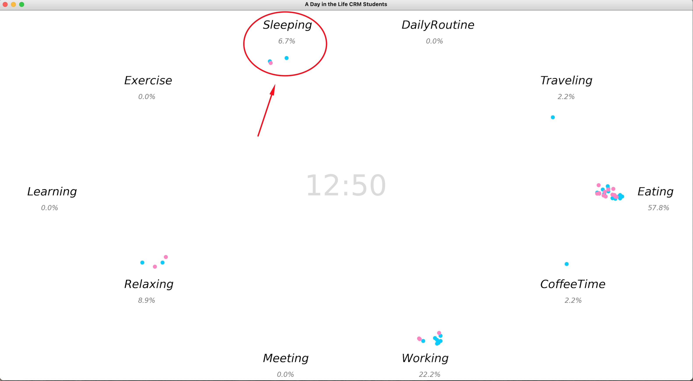
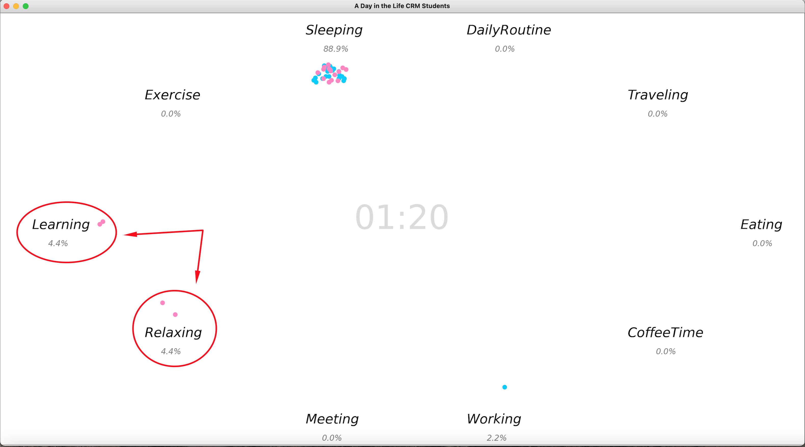
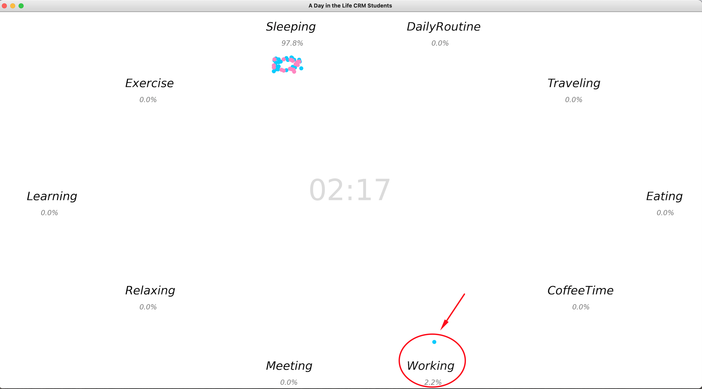

# A Day in the Life CRM Students
This presentation shows the activities in a day of CRM students. Each dot represents a person and color represent the gender. When someone change the activity such as from Sleeping to Traveling, the dot move accordingly.

This presentation we group the activities to be 10 groups
1.  Sleeping
2.  DailyRoutine: 
3.  Traveling:
4.  Eating:
5.  CoffeeTime:
6.  Working:
7.  Meeting:
8.  Relaxing:
9.  Learning:
10. Exercise:

## Example

## The things that we fonund

1. Students more than 50% getup before 7:30 AM

2. We also somebody who take sleep on noon.

3. Women stay late at night more than male

4. We have a friend who work hard all day long.

