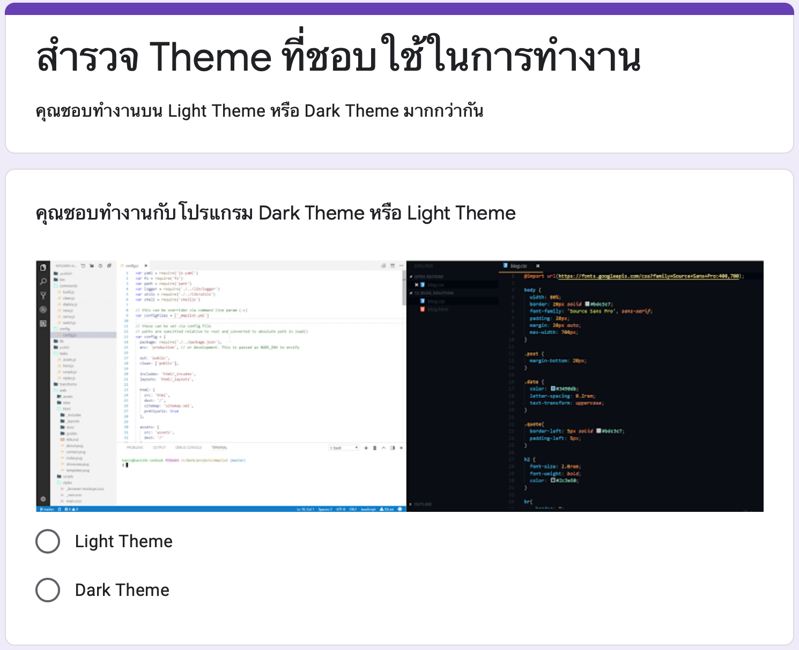
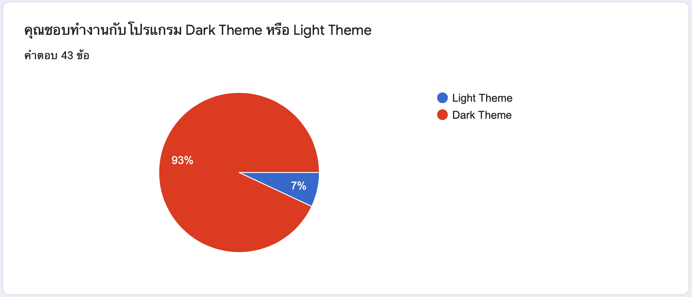

# A/B Testing

**Target survey**
The person who work in the IT department who have to use the program for coding

**Method**
Use google form to ask the question about preferenec to use dark theme and ligh theme

## Form

## Result
Most of people in IT department prefer to use the dark theme for programming more than use light theme

Then if we would like to create extension for the program that IT department use. IF the extension able to support the dark theme it will get more satisfaction from customer