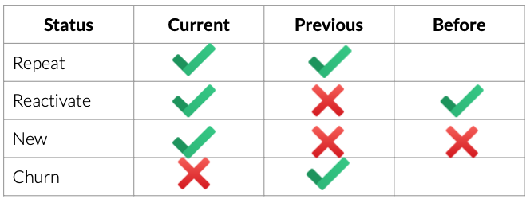
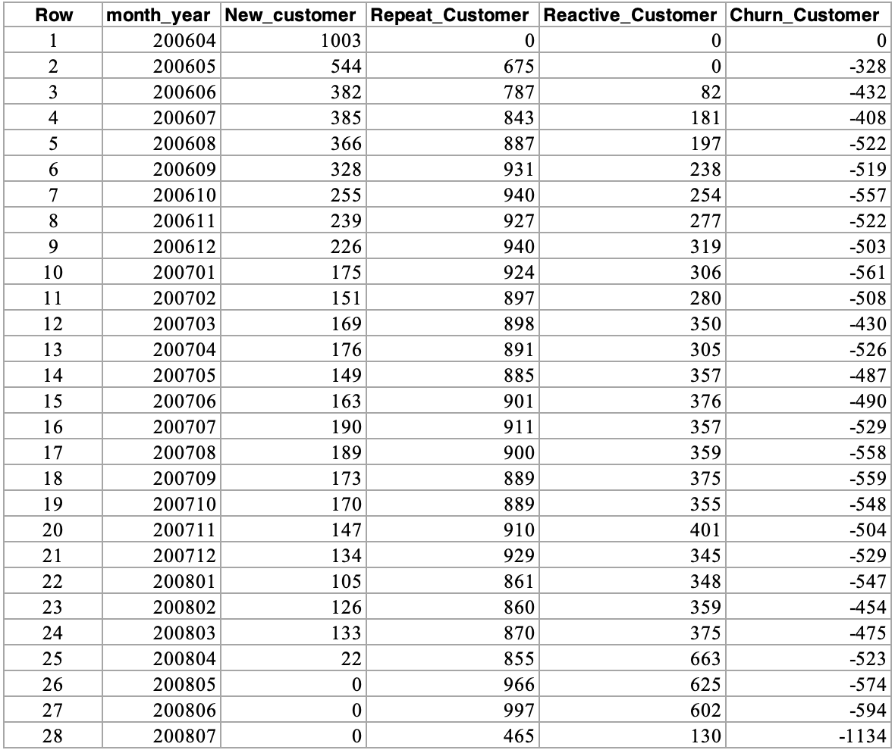

# Customer Movement Analysis
We grouped customers to be 4 categories base on customer behaveior in the table below

Current: Customer made purchases on the current month.
Previous: Customer made purchases on the last month.
Before: Customer made purchases before last month. 

**SQL:** [query.sql](https://github.com/watcharapon-w/BADS7105-CRM-analytics-and-intelligence/blob/main/Homework%2012%20-%20Design%20Thinking/HW12%20Design%20Thinking.pdf)

The query result.

